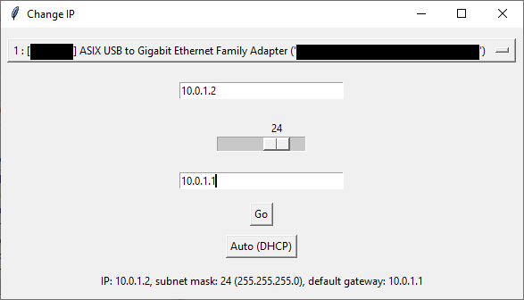

# IPChanger

Because going into Network and Sharing Centre is just too troublesome.


- Change IP address, subnet mask or default gateway of any active network interface
- Sanity checks for invalid inputs (e.g. local IPs, Gateway address not in subnet)
(Still WIP, not polished but functional)
## Build
```
pip install -r requirements.txt
pyinstaller -w --noconsole --noconfirm --onefile main.py
```
